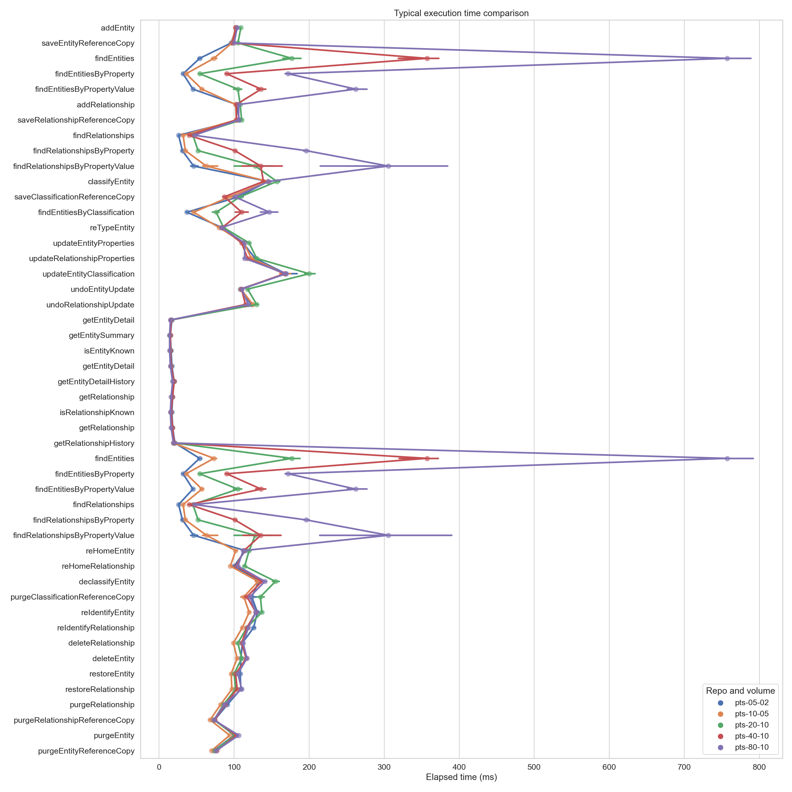
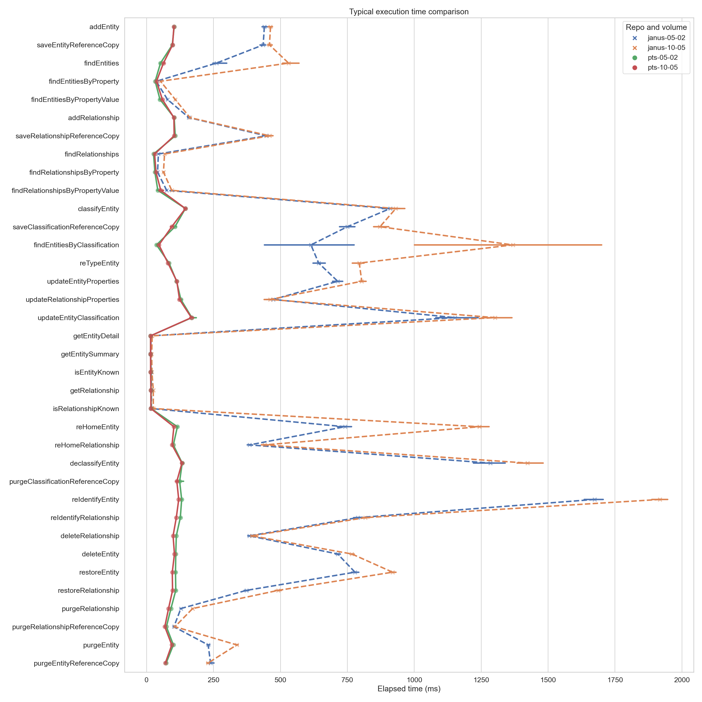

<!-- SPDX-License-Identifier: CC-BY-4.0 -->
<!-- Copyright Contributors to the ODPi Egeria project. -->

# Test Suites

This directory contains information regarding the automated Test Suites and the Crux connector, for the latest available
releases. [Historical results, for prior releases, are kept separately, by release.](historical/)

## Charts

The `charts` sub-directory contains a Helm chart to automate the execution of these suites against a Crux repository
connector, to produce a set of repeatable results.

These use a default configuration for the Crux repository where Lucene is used as a text index and RocksDB is used for
all persistence: index store, document store and transaction log. No additional tuning of any parameters (Crux or RocksDB)
is applied: they use all of their default settings.

## Results contents

The `results` sub-directory contains results of running the suites against the Crux connector. For each test suite execution,
you will find the following details:

- `openmetadata_cts_summary.json` - a summary of the results of each profile
- Description of the k8s environment
  - `deployment` - details of the deployed components used for the test
  - `configmap.yaml` - details of the variables used within the components of the test
- The OMAG server configurations:
  - `omag.server.crux.config` - the configuration of the Crux connector (proxy)
  - `omag.server.cts.config` - the configuration of the test workbench
- The cohort registrations:
  - `cohort.coco.crux.local` - the local Crux connector (proxy) cohort registration information
  - `cohort.coco.crux.remote` - the cohort members considered remote from the Crux connector (proxy)'s perspective
  - `cohort.coco.cts.local` - the local test Workbench cohort registration
  - `cohort.coco.cts.remote` - the cohort members considered remote from the test Workbench's perspective
- Detailed results:
  - `pd.tar.gz` - an archive containing the full detailed results of every profile tested
  - `tcd.tar.gz` - an archive containing the full detailed results of every test case executed
- Jupyter Notebooks used to analyze the results:
  - `analyze-performance-results.ipynb` - details about the environment, instance counts, and distribution of elapsed
    times per method, also illustrating how the results can be analyzed more deeply
  - `calculate-medians.ipynb` - used to calculate the medians displayed in the table further below
  - (to run either of these notebooks, you will need to first extract the `pd.tar.gz` file to have the JSON results
    files for analysis)

## Conformance Test Suite (CTS) Results

The CTS measures conformance of the repository with the expected behavior of an Egeria repository. Conformance indicates
that the repository behaves precisely as expected for an Egeria repository.

Profile | Result | Connector | Egeria | Crux
---|---|---|---|---
Metadata sharing | CONFORMANT_FULL_SUPPORT | 2.11 | 2.11 | 1.17.1
Reference copies | CONFORMANT_FULL_SUPPORT | 2.11 | 2.11 | 1.17.1
Metadata maintenance | CONFORMANT_FULL_SUPPORT | 2.11 | 2.11 | 1.17.1
Dynamic types | UNKNOWN_STATUS | 2.11 | 2.11 | 1.17.1
Graph queries | CONFORMANT_FULL_SUPPORT | 2.11 | 2.11 | 1.17.1
Historical search | CONFORMANT_FULL_SUPPORT | 2.11 | 2.11 | 1.17.1
Entity proxies | CONFORMANT_FULL_SUPPORT | 2.11 | 2.11 | 1.17.1
Soft-delete and restore | CONFORMANT_FULL_SUPPORT | 2.11 | 2.11 | 1.17.1
Undo an update | CONFORMANT_FULL_SUPPORT | 2.11 | 2.11 | 1.17.1
Reidentify instance | CONFORMANT_FULL_SUPPORT | 2.11 | 2.11 | 1.17.1
Retype instance | CONFORMANT_FULL_SUPPORT | 2.11 | 2.11 | 1.17.1
Rehome instance | CONFORMANT_FULL_SUPPORT | 2.11 | 2.11 | 1.17.1
Entity search | CONFORMANT_FULL_SUPPORT | 2.11 | 2.11 | 1.17.1
Relationship search | CONFORMANT_FULL_SUPPORT | 2.11 | 2.11 | 1.17.1
Entity advanced search | CONFORMANT_FULL_SUPPORT | 2.11 | 2.11 | 1.17.1
Relationship advanced search | CONFORMANT_FULL_SUPPORT | 2.11 | 2.11 | 1.17.1

### Notes

- The entity search tests could fail a particular long-running query pattern unless Lucene is configured:
  typically where a query by value or attribute is done without providing any restriction on the type of instances against
  which the query should run. Configure the connector with Lucene to avoid these timeouts.
- The `Dynamic types` profile currently does not have any tests defined, so will be `UNKNOWN_STATUS` for all repositories
  and connectors.

## Performance Test Suite (PTS) Results

The PTS focuses on measuring the performance of the various operations of an Egeria repository. It does not do as
thorough checking of every individual result as the CTS, but instead ensures a consistent volume of metadata exists in
the environment for the duration of the tests and records various metrics about both these volumes and the individual
runtimes of each execution of the various metadata repository operations.

Following are base statistics on the various repository methods: all times in milliseconds.

The _median_ of all results for that method across all executions for a given set of volume parameters is given below
(all times in milliseconds) to give an idea of the "typical" result, while limiting potential skew from significant
outliers.

A more detailed set of statistics is best reviewed through the Jupyter Notebook provided in each results directory,
where you can review:

- the full distributions of execution times (including the outliers)
- detailed individual outlier results (e.g. the top-10 slowest response times per method)
- volumes in place during the tests (how many entities, how many relationships, etc)

The volume parameters that were used for each test are specified using the following convention:

- `i-s`, where `i` is the value for the `instancesPerType` parameter to the PTS and `s` is the value for
  `maxSearchResults`. For example, `5-2` means 5 instances will be created for every open metadata type and 2 will be
  the maximum number of results per page for methods that include paging.
  - All tests are run from `5-2` through `20-10` to give a sense of the performance impact of doubling the number
    of instances and search results.
  - Above this, the graph queries are no longer included: they become exponentially more complex as the volumes grow, and
    while they will still return results, the depth of their testing in the PTS means that they can contribute many hours
    (or even days) to the overall suite execution -- they are therefore left out to be able to more quickly produce
    results for the other methods at progressively higher volumes.
  - The page size is left at a maximum of `10` for subsequent tests so that it is only the volume of instances in total
    that are doubling each time, rather than also the number of detailed results.
  - Instance counts range from 4,410 (at `5-2`) up to 70,560 (at `80-10`).

### Crux (connector 2.11, Egeria 2.11, Crux 1.17.1)

> Graphical comparison of volumes

In the graphical comparison, a point plot is used to show the typical execution time of each method at the different
volumes. Each point on the plot represents the _median_ execution time for that method, at a given volume of metadata.
The horizontal lines that appear around each point are confidence intervals calculated by a bootstrapping process: in
simple terms, the larger the horizontal line, the more variability there is for that particular method's execution time
(a singular median value is insufficient to represent such variability).

We can see that the retrieval and write operations remain very consistent, with almost no variability, throughout the
growth in volume. The search operations, however, begin to clearly degrade at the highest volumes tested. Further
investigation into other optimized settings for the search operations for these larger volumes is likely warranted
as the next step to continue to improve performance.

Profile | Method | 05-02 (4,630) | 10-05 (9,260) | 20-10 (18,520) | 40-10 (37,040) | 80-10 (74,080)
---|---|---|---|---|---|---
Entity creation | addEntity | 103.0 | 102.0 | 109.0 | 102.0 | 104.0
... | saveEntityReferenceCopy | 96.0 | 97.0 | 105.0 | 98.0 | 100.0
Entity search | findEntities | 52.0 | 63.0 | 140.0 | 260.0 | 495.5
... | findEntitiesByProperty | 32.0 | 37.0 | 55.0 | 101.0 | 193.0
... | findEntitiesByPropertyValue | 50.0 | 59.0 | 102.5 | 129.0 | 201.5
Relationship creation | addRelationship | 103.0 | 102.0 | 108.0 | 103.0 | 106.0
... | saveRelationshipReferenceCopy | 107.0 | 103.0 | 110.0 | 103.0 | 106.0
Relationship search | findRelationships | 26.0 | 30.0 | 39.0 | 36.0 | 40.0
... | findRelationshipsByProperty | 31.0 | 35.0 | 52.0 | 104.0 | 204.0
... | findRelationshipsByPropertyValue | 42.0 | 53.0 | 81.0 | 101.0 | 215.0
Entity classification | classifyEntity | 145.0 | 145.0 | 157.0 | 139.0 | 146.0
... | saveClassificationReferenceCopy | 106.0 | 94.0 | 108.0 | 87.0 | 101.0
Classification search | findEntitiesByClassification | 37.0 | 46.0 | 76.0 | 110.0 | 147.0
Entity update | reTypeEntity | 89.0 | 86.0 | 93.0 | 89.0 | 87.0
... | updateEntityProperties | 112.0 | 113.0 | 120.0 | 110.0 | 114.0
Relationship update | updateRelationshipProperties | 128.0 | 123.0 | 130.0 | 118.0 | 114.0
Classification update | updateEntityClassification | 169.0 | 167.5 | 200.0 | 167.0 | 169.0
Entity undo | undoEntityUpdate | 108.0 | 109.0 | 118.0 | 110.0 | 110.0
Relationship undo | undoRelationshipUpdate | 123.0 | 125.0 | 130.0 | 115.0 | 119.0
Entity retrieval | getEntityDetail | 15.0 | 15.0 | 15.0 | 15.0 | 14.0
... | getEntitySummary | 15.0 | 15.0 | 14.0 | 15.0 | 14.0
... | isEntityKnown | 16.0 | 15.0 | 15.0 | 15.0 | 14.0
Entity history retrieval | getEntityDetail | 18.0 | 18.0 | 17.0 | 18.0 | 17.0
... | getEntityDetailHistory | 20.0 | 19.0 | 19.0 | 20.0 | 18.0
Relationship retrieval | getRelationship | 17.0 | 16.0 | 16.0 | 16.0 | 15.0
... | isRelationshipKnown | 17.0 | 16.0 | 16.0 | 16.0 | 15.0
Relationship history retrieval | getRelationship | 20.0 | 18.0 | 19.0 | 19.0 | 18.0
... | getRelationshipHistory | 21.0 | 19.0 | 20.0 | 20.0 | 19.0
Entity history search | findEntities | 58.0 | 92.0 | 253.5 | 478.0 | 1787.5
... | findEntitiesByProperty | 29.0 | 33.0 | 49.0 | 53.0 | 80.0
... | findEntitiesByPropertyValue | 41.0 | 55.0 | 106.0 | 144.0 | 380.5
Relationship history search | findRelationships | 27.0 | 34.0 | 55.0 | 48.0 | 59.0
... | findRelationshipsByProperty | 31.0 | 42.0 | 76.0 | 59.0 | 79.5
... | findRelationshipsByPropertyValue | 50.0 | 79.0 | 180.0 | 160.0 | 363.0
Graph queries | getEntityNeighborhood | 27.0 | 25.0 | 27.0 | -- | --
... | getLinkingEntities | 20.0 | 25.0 | 40.0 | -- | --
... | getRelatedEntities | 540.5 | 1182.5 | 3616.0 | -- | --
... | getRelationshipsForEntity | 26.0 | 26.0 | 28.0 | -- | --
Graph history queries | getEntityNeighborhood | 26.0 | 25.0 | 26.0 | -- | --
... | getLinkingEntities | 21.0 | 25.0 | 39.0 | -- | --
... | getRelatedEntities | 539.0 | 1169.0 | 3629.5 | -- | --
... | getRelationshipsForEntity | 24.0 | 25.0 | 26.0 | -- | --
Entity re-home | reHomeEntity | 115.0 | 102.0 | 120.0 | 113.0 | 112.0
Relationship re-home | reHomeRelationship | 100.0 | 95.0 | 114.0 | 103.0 | 105.0
Entity declassify | declassifyEntity | 133.0 | 132.0 | 155.0 | 137.0 | 141.0
... | purgeClassificationReferenceCopy | 123.5 | 113.0 | 135.0 | 117.0 | 121.0
Entity re-identify | reIdentifyEntity | 131.0 | 120.0 | 137.0 | 129.0 | 129.0
Relationship re-identify | reIdentifyRelationship | 126.0 | 111.0 | 117.0 | 117.0 | 119.0
Relationship delete | deleteRelationship | 111.0 | 99.0 | 105.0 | 110.0 | 112.0
Entity delete | deleteEntity | 109.0 | 104.0 | 110.0 | 116.0 | 117.0
Entity restore | restoreEntity | 108.0 | 96.0 | 100.0 | 102.0 | 105.0
Relationship restore | restoreRelationship | 109.0 | 97.0 | 102.0 | 104.0 | 110.0
Relationship purge | purgeRelationship | 91.0 | 82.0 | 86.0 | 88.0 | 87.0
... | purgeRelationshipReferenceCopy | 74.0 | 68.0 | 73.0 | 74.0 | 73.0
Entity purge | purgeEntity | 100.0 | 94.0 | 101.0 | 103.0 | 106.0
... | purgeEntityReferenceCopy | 73.0 | 70.0 | 74.0 | 77.0 | 76.0

### Crux (connector 2.11, Egeria 2.11, Crux 1.17.1) vs JanusGraph (Egeria 2.11)

**Note**: the graph queries were disabled for JanusGraph in order to have results in a timely manner.
Unfortunately, the graph queries portion of the suite for a single metadata type had not completed after more than 3
hours in this connector, so the complete graph queries portion would take _more than a month of non-stop execution_ to
complete (even at the lowest volume (5-2) configuration). This portion of the tests was therefore explicitly skipped,
and hence no results are shown for those methods below.

In the graphical comparison, a point plot is used to show the typical execution time of each method at the different
volumes for the two repositories. Each point on the plot represents the _median_ execution time for that method, in a
given repository (`pts` = Crux, `janus` = JanusGraph), with a given volume of metadata (`5-2` = 4,470 instances,
`10-5` = 8,940 instances). The horizontal lines that appear around each point are confidence intervals calculated by
a bootstrapping process: in simple terms, the larger the horizontal line, the more variability there is for that
particular method's execution time (a singular median value is insufficient to represent such variability).

> Graphical comparison of repositories

The Crux results can be difficult to see in detail due to the skew from the Janus results, so it may be easier to look
at this more granular comparison that drops the higher scales of Janus for readability of the Crux results:

> Graphical comparison of repositories (without large Janus volumes)

Note that in almost all cases, the Crux repository is _significantly_ faster than JanusGraph: at most volumes completing
all methods in less than 200ms and with very little variability (horizontal confidence intervals are not even visible
for most methods). For JanusGraph, on the other hand, there is significant variability (in particular for methods like
`findEntitiesByClassification`), and there are numerous examples of the median execution time taking more than multiple
seconds.

Following is a table of the specific median values for each repository and volume (also including the results for
methods that are only currently implemented by the Crux repository connector, or only return in a sufficiently timely
manner to be included in the tests):

Profile | Method | 05-02 (Crux) | 05-02 (Janus) | 10-05 (Crux) | 10-05 (Janus) | 20-10 (Crux) | 20-10 (Janus) | 40-10 (Crux) | 40-10 (Janus) | 80-10 (Crux) | 80-10 (Janus)
---|---|---|---|---|---|---|---|---|---|---|---
Entity creation | addEntity | 103.0 | 440.0 | 102.0 | 463.0 | 109.0
... | saveEntityReferenceCopy | 96.0 | 435.5 | 97.0 | 459.0 | 105.0
Entity search | findEntities | 52.0 | 261.0 | 63.0 | 530.5 | 140.0
... | findEntitiesByProperty | 32.0 | 36.0 | 37.0 | 52.0 | 55.0
... | findEntitiesByPropertyValue | 50.0 | 78.0 | 59.0 | 107.0 | 102.5
Relationship creation | addRelationship | 103.0 | 158.0 | 102.0 | 162.0 | 108.0
... | saveRelationshipReferenceCopy | 107.0 | 447.0 | 103.0 | 460.0 | 110.0
Relationship search | findRelationships | 26.0 | 44.0 | 30.0 | 67.0 | 39.0
... | findRelationshipsByProperty | 31.0 | 41.0 | 35.0 | 63.0 | 52.0
... | findRelationshipsByPropertyValue | 42.0 | 75.0 | 53.0 | 94.0 | 81.0
Entity classification | classifyEntity | 145.0 | 910.0 | 145.0 | 931.0 | 157.0
... | saveClassificationReferenceCopy | 106.0 | 750.0 | 94.0 | 872.0 | 108.0
Classification search | findEntitiesByClassification | 37.0 | 614.0 | 46.0 | 1368.5 | 76.0
Entity update | reTypeEntity | 89.0 | 381.0 | 86.0 | 432.0 | 93.0
... | updateEntityProperties | 112.0 | 714.0 | 113.0 | 804.0 | 120.0
Relationship update | updateRelationshipProperties | 128.0 | 473.0 | 123.0 | 461.5 | 130.0
Classification update | updateEntityClassification | 169.0 | 1152.0 | 167.5 | 1301.5 | 200.0
Entity undo | undoEntityUpdate | 108.0 | -- | 109.0 | -- | 118.0
Relationship undo | undoRelationshipUpdate | 123.0 | -- | 125.0 | -- | 130.0
Entity retrieval | getEntityDetail | 15.0 | 17.0 | 15.0 | 21.0 | 15.0
... | getEntitySummary | 15.0 | 15.0 | 15.0 | 19.0 | 14.0
... | isEntityKnown | 16.0 | 17.0 | 15.0 | 20.0 | 15.0
Entity history retrieval | getEntityDetail | 18.0 | -- | 18.0 | -- | 17.0
... | getEntityDetailHistory | 20.0 | -- | 19.0 | -- | 19.0
Relationship retrieval | getRelationship | 17.0 | 18.0 | 16.0 | 25.0 | 16.0
... | isRelationshipKnown | 17.0 | 18.0 | 16.0 | 25.0 | 16.0
Relationship history retrieval | getRelationship | 20.0 | -- | 18.0 | -- | 19.0
... | getRelationshipHistory | 21.0 | -- | 19.0 | -- | 20.0
Entity history search | findEntities | 58.0 | -- | 92.0 | -- | 253.5
... | findEntitiesByProperty | 29.0 | -- | 33.0 | -- | 49.0
... | findEntitiesByPropertyValue | 41.0 | -- | 55.0 | -- | 106.0
Relationship history search | findRelationships | 27.0 | -- | 34.0 | -- | 55.0
... | findRelationshipsByProperty | 31.0 | -- | 42.0 | -- | 76.0
... | findRelationshipsByPropertyValue | 50.0 | -- | 79.0 | -- | 180.0
Graph queries | getEntityNeighborhood | 27.0 | -- | 25.0 | -- | 27.0
... | getLinkingEntities | 20.0 | -- | 25.0 | -- | 40.0
... | getRelatedEntities | 540.5 | -- | 1182.5 | -- | 3616.0
... | getRelationshipsForEntity | 26.0 | -- | 26.0 | -- | 28.0
Graph history queries | getEntityNeighborhood | 26.0 | -- | 25.0 | -- | 26.0
... | getLinkingEntities | 21.0 | -- | 25.0 | -- | 39.0
... | getRelatedEntities | 539.0 | -- | 1169.0 | -- | 3629.5
... | getRelationshipsForEntity | 24.0 | -- | 25.0 | -- | 26.0
Entity re-home | reHomeEntity | 115.0 | 741.0 | 102.0 | 1244.0 | 120.0
Relationship re-home | reHomeRelationship | 100.0 | 384.5 | 95.0 | 441.0 | 114.0
Entity declassify | declassifyEntity | 133.0 | 1284.0 | 132.0 | 1423.0 | 155.0
... | purgeClassificationReferenceCopy | 123.5 | -- | 113.0 | -- | 135.0
Entity re-identify | reIdentifyEntity | 131.0 | 1674.0 | 120.0 | 1918.0 | 137.0
Relationship re-identify | reIdentifyRelationship | 126.0 | 789.0 | 111.0 | 817.0 | 117.0
Relationship delete | deleteRelationship | 111.0 | 384.0 | 99.0 | 394.0 | 105.0
Entity delete | deleteEntity | 109.0 | 714.0 | 104.0 | 767.0 | 110.0
Entity restore | restoreEntity | 108.0 | 778.5 | 96.0 | 919.0 | 100.0
Relationship restore | restoreRelationship | 109.0 | 373.0 | 97.0 | 492.0 | 102.0
Relationship purge | purgeRelationship | 91.0 | 128.0 | 82.0 | 172.0 | 86.0
... | purgeRelationshipReferenceCopy | 74.0 | 102.0 | 68.0 | 106.0 | 73.0
Entity purge | purgeEntity | 100.0 | 230.0 | 94.0 | 337.0 | 101.0
... | purgeEntityReferenceCopy | 73.0 | 239.0 | 70.0 | 229.0 | 74.0

----
License: [CC BY 4.0](https://creativecommons.org/licenses/by/4.0/),
Copyright Contributors to the ODPi Egeria project.
