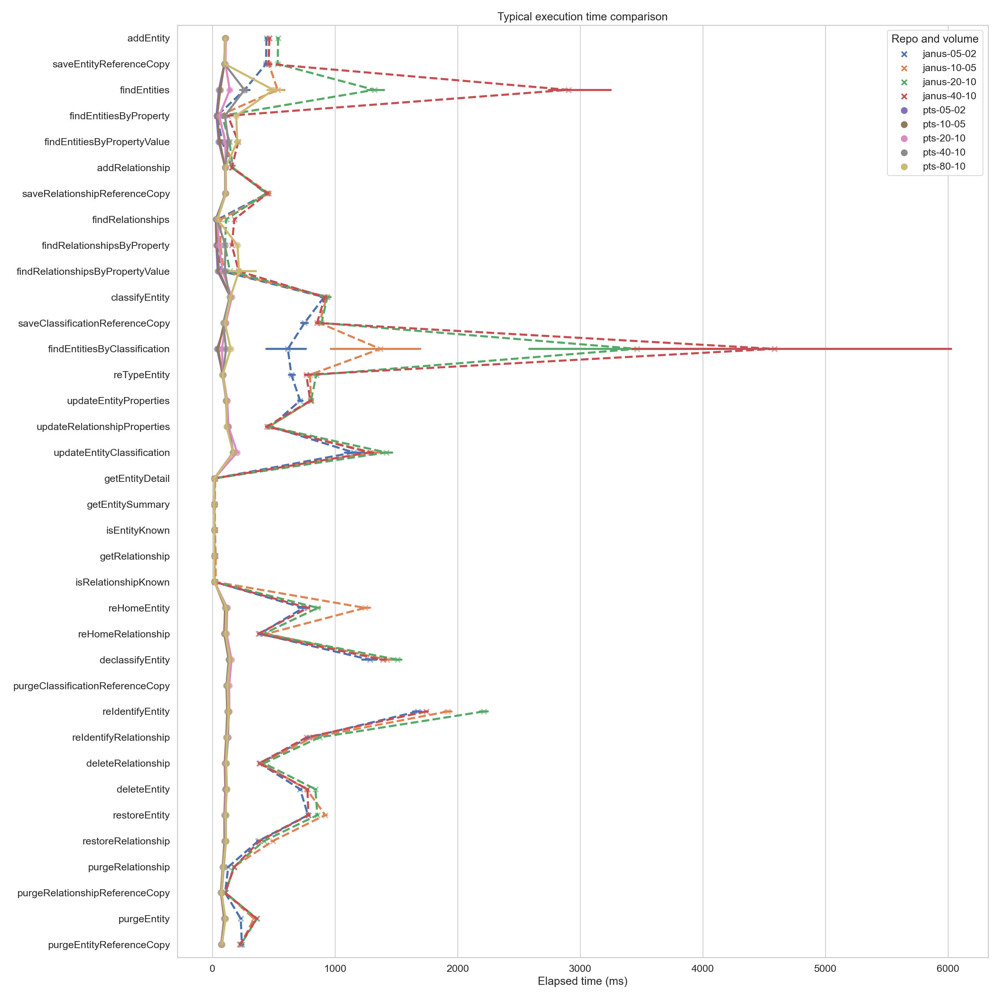
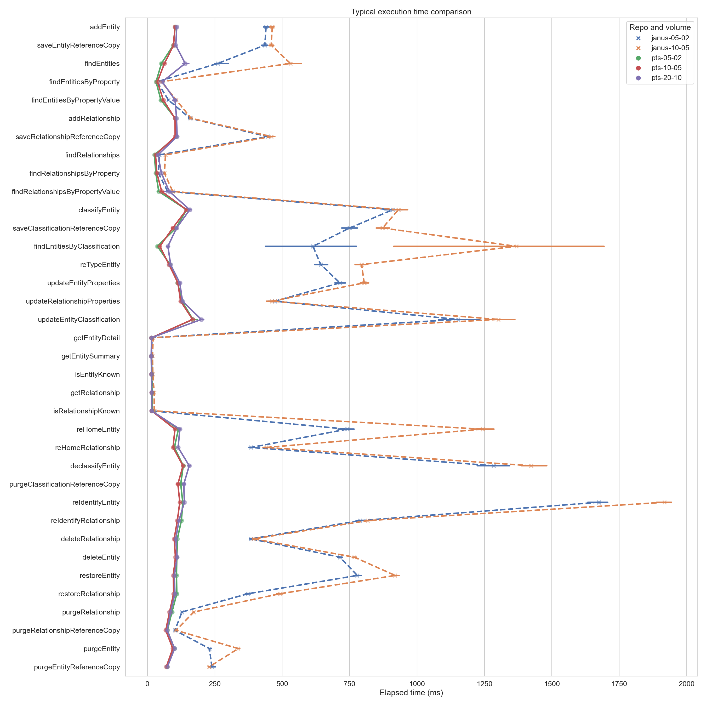

<!-- SPDX-License-Identifier: CC-BY-4.0 -->
<!-- Copyright Contributors to the ODPi Egeria project. -->

# Release 2.11

## CTS results

!!! success "The 2.11 release is fully conformant with all Egeria profiles"

Profile | Result | Connector | Egeria | Crux
---|---|---|---|---
Metadata sharing | CONFORMANT_FULL_SUPPORT | 2.11 | 2.11 | 1.17.1
Reference copies | CONFORMANT_FULL_SUPPORT | 2.11 | 2.11 | 1.17.1
Metadata maintenance | CONFORMANT_FULL_SUPPORT | 2.11 | 2.11 | 1.17.1
Dynamic types | UNKNOWN_STATUS | 2.11 | 2.11 | 1.17.1
Graph queries | CONFORMANT_FULL_SUPPORT | 2.11 | 2.11 | 1.17.1
Historical search | CONFORMANT_FULL_SUPPORT | 2.11 | 2.11 | 1.17.1
Entity proxies | CONFORMANT_FULL_SUPPORT | 2.11 | 2.11 | 1.17.1
Soft-delete and restore | CONFORMANT_FULL_SUPPORT | 2.11 | 2.11 | 1.17.1
Undo an update | CONFORMANT_FULL_SUPPORT | 2.11 | 2.11 | 1.17.1
Reidentify instance | CONFORMANT_FULL_SUPPORT | 2.11 | 2.11 | 1.17.1
Retype instance | CONFORMANT_FULL_SUPPORT | 2.11 | 2.11 | 1.17.1
Rehome instance | CONFORMANT_FULL_SUPPORT | 2.11 | 2.11 | 1.17.1
Entity search | CONFORMANT_FULL_SUPPORT | 2.11 | 2.11 | 1.17.1
Relationship search | CONFORMANT_FULL_SUPPORT | 2.11 | 2.11 | 1.17.1
Entity advanced search | CONFORMANT_FULL_SUPPORT | 2.11 | 2.11 | 1.17.1
Relationship advanced search | CONFORMANT_FULL_SUPPORT | 2.11 | 2.11 | 1.17.1

??? info "Additional notes"
    - The entity search tests could fail a particular long-running query pattern unless Lucene is configured:
      typically where a query by value or attribute is done without providing any restriction on the type of instances against
      which the query should run. Configure the connector with Lucene to avoid these timeouts.
    - The `Dynamic types` profile currently does not have any tests defined, so will be `UNKNOWN_STATUS` for all repositories
      and connectors.

## PTS results

### Crux at varying volumes

!!! summary
    The retrieval and write operations remain very consistent, with almost no variability, throughout the
    growth in volume. The search operations, however, begin to clearly degrade at the highest volumes tested. Further
    investigation into other optimized settings for the search operations for these larger volumes is likely warranted
    as the next step to continue to improve performance.

Profile | Method | 05-02 (4,630) | 10-05 (9,260) | 20-10 (18,520) | 40-10 (37,040) | 80-10 (74,080)
---|---|---|---|---|---|---
Entity creation | addEntity | 103.0 | 102.0 | 109.0 | 102.0 | 104.0
... | saveEntityReferenceCopy | 96.0 | 97.0 | 105.0 | 98.0 | 100.0
Entity search | findEntities | 52.0 | 63.0 | 140.0 | 260.0 | 495.5
... | findEntitiesByProperty | 32.0 | 37.0 | 55.0 | 101.0 | 193.0
... | findEntitiesByPropertyValue | 50.0 | 59.0 | 102.5 | 129.0 | 201.5
Relationship creation | addRelationship | 103.0 | 102.0 | 108.0 | 103.0 | 106.0
... | saveRelationshipReferenceCopy | 107.0 | 103.0 | 110.0 | 103.0 | 106.0
Relationship search | findRelationships | 26.0 | 30.0 | 39.0 | 36.0 | 40.0
... | findRelationshipsByProperty | 31.0 | 35.0 | 52.0 | 104.0 | 204.0
... | findRelationshipsByPropertyValue | 42.0 | 53.0 | 81.0 | 101.0 | 215.0
Entity classification | classifyEntity | 145.0 | 145.0 | 157.0 | 139.0 | 146.0
... | saveClassificationReferenceCopy | 106.0 | 94.0 | 108.0 | 87.0 | 101.0
Classification search | findEntitiesByClassification | 37.0 | 46.0 | 76.0 | 110.0 | 147.0
Entity update | reTypeEntity | 89.0 | 86.0 | 93.0 | 89.0 | 87.0
... | updateEntityProperties | 112.0 | 113.0 | 120.0 | 110.0 | 114.0
Relationship update | updateRelationshipProperties | 128.0 | 123.0 | 130.0 | 118.0 | 114.0
Classification update | updateEntityClassification | 169.0 | 167.5 | 200.0 | 167.0 | 169.0
Entity undo | undoEntityUpdate | 108.0 | 109.0 | 118.0 | 110.0 | 110.0
Relationship undo | undoRelationshipUpdate | 123.0 | 125.0 | 130.0 | 115.0 | 119.0
Entity retrieval | getEntityDetail | 15.0 | 15.0 | 15.0 | 15.0 | 14.0
... | getEntitySummary | 15.0 | 15.0 | 14.0 | 15.0 | 14.0
... | isEntityKnown | 16.0 | 15.0 | 15.0 | 15.0 | 14.0
Entity history retrieval | getEntityDetail | 18.0 | 18.0 | 17.0 | 18.0 | 17.0
... | getEntityDetailHistory | 20.0 | 19.0 | 19.0 | 20.0 | 18.0
Relationship retrieval | getRelationship | 17.0 | 16.0 | 16.0 | 16.0 | 15.0
... | isRelationshipKnown | 17.0 | 16.0 | 16.0 | 16.0 | 15.0
Relationship history retrieval | getRelationship | 20.0 | 18.0 | 19.0 | 19.0 | 18.0
... | getRelationshipHistory | 21.0 | 19.0 | 20.0 | 20.0 | 19.0
Entity history search | findEntities | 58.0 | 92.0 | 253.5 | 478.0 | 1787.5
... | findEntitiesByProperty | 29.0 | 33.0 | 49.0 | 53.0 | 80.0
... | findEntitiesByPropertyValue | 41.0 | 55.0 | 106.0 | 144.0 | 380.5
Relationship history search | findRelationships | 27.0 | 34.0 | 55.0 | 48.0 | 59.0
... | findRelationshipsByProperty | 31.0 | 42.0 | 76.0 | 59.0 | 79.5
... | findRelationshipsByPropertyValue | 50.0 | 79.0 | 180.0 | 160.0 | 363.0
Graph queries | getEntityNeighborhood | 27.0 | 25.0 | 27.0 | -- | --
... | getLinkingEntities | 20.0 | 25.0 | 40.0 | -- | --
... | getRelatedEntities | 540.5 | 1182.5 | 3616.0 | -- | --
... | getRelationshipsForEntity | 26.0 | 26.0 | 28.0 | -- | --
Graph history queries | getEntityNeighborhood | 26.0 | 25.0 | 26.0 | -- | --
... | getLinkingEntities | 21.0 | 25.0 | 39.0 | -- | --
... | getRelatedEntities | 539.0 | 1169.0 | 3629.5 | -- | --
... | getRelationshipsForEntity | 24.0 | 25.0 | 26.0 | -- | --
Entity re-home | reHomeEntity | 115.0 | 102.0 | 120.0 | 113.0 | 112.0
Relationship re-home | reHomeRelationship | 100.0 | 95.0 | 114.0 | 103.0 | 105.0
Entity declassify | declassifyEntity | 133.0 | 132.0 | 155.0 | 137.0 | 141.0
... | purgeClassificationReferenceCopy | 123.5 | 113.0 | 135.0 | 117.0 | 121.0
Entity re-identify | reIdentifyEntity | 131.0 | 120.0 | 137.0 | 129.0 | 129.0
Relationship re-identify | reIdentifyRelationship | 126.0 | 111.0 | 117.0 | 117.0 | 119.0
Relationship delete | deleteRelationship | 111.0 | 99.0 | 105.0 | 110.0 | 112.0
Entity delete | deleteEntity | 109.0 | 104.0 | 110.0 | 116.0 | 117.0
Entity restore | restoreEntity | 108.0 | 96.0 | 100.0 | 102.0 | 105.0
Relationship restore | restoreRelationship | 109.0 | 97.0 | 102.0 | 104.0 | 110.0
Relationship purge | purgeRelationship | 91.0 | 82.0 | 86.0 | 88.0 | 87.0
... | purgeRelationshipReferenceCopy | 74.0 | 68.0 | 73.0 | 74.0 | 73.0
Entity purge | purgeEntity | 100.0 | 94.0 | 101.0 | 103.0 | 106.0
... | purgeEntityReferenceCopy | 73.0 | 70.0 | 74.0 | 77.0 | 76.0

### Crux vs JanusGraph

!!! summary
    In almost all cases, the Crux repository is _significantly_ faster than JanusGraph: at most volumes completing
    all methods in less than 200ms and with very little variability. For JanusGraph, on the other hand, there is
    significant variability (in particular for methods like `findEntitiesByClassification`), and there are numerous
    examples of the median execution time taking more than multiple seconds.

    Even at 8 times the volume of metadata the Crux connector still outperforms the JanusGraph connector in almost every
    method (the only exceptions being a few of the find methods, where the performance is approximately even at 2-4 times
    the volume).

!!! attention "Graph queries were disabled for JanusGraph"
    The graph queries were disabled for JanusGraph in order to have results in a timely manner: it would take more
    than a month to produce results for these queries for the JanusGraph connector.

The Crux results can be difficult to see in detail due to the skew from the Janus results, so it may be easier to look
at this more granular comparison that drops the higher scales of Janus for readability of the Crux results:

Profile | Method | 05-02 (Crux) | 05-02 (Janus) | 10-05 (Crux) | 10-05 (Janus) | 20-10 (Crux) | 20-10 (Janus) | 40-10 (Crux) | 40-10 (Janus) | 80-10 (Crux) | 80-10 (Janus)
---|---|---|---|---|---|---|---|---|---|---|---
Entity creation | addEntity | 103.0 | 440.0 | 102.0 | 463.0 | 109.0
... | saveEntityReferenceCopy | 96.0 | 435.5 | 97.0 | 459.0 | 105.0
Entity search | findEntities | 52.0 | 261.0 | 63.0 | 530.5 | 140.0
... | findEntitiesByProperty | 32.0 | 36.0 | 37.0 | 52.0 | 55.0
... | findEntitiesByPropertyValue | 50.0 | 78.0 | 59.0 | 107.0 | 102.5
Relationship creation | addRelationship | 103.0 | 158.0 | 102.0 | 162.0 | 108.0
... | saveRelationshipReferenceCopy | 107.0 | 447.0 | 103.0 | 460.0 | 110.0
Relationship search | findRelationships | 26.0 | 44.0 | 30.0 | 67.0 | 39.0
... | findRelationshipsByProperty | 31.0 | 41.0 | 35.0 | 63.0 | 52.0
... | findRelationshipsByPropertyValue | 42.0 | 75.0 | 53.0 | 94.0 | 81.0
Entity classification | classifyEntity | 145.0 | 910.0 | 145.0 | 931.0 | 157.0
... | saveClassificationReferenceCopy | 106.0 | 750.0 | 94.0 | 872.0 | 108.0
Classification search | findEntitiesByClassification | 37.0 | 614.0 | 46.0 | 1368.5 | 76.0
Entity update | reTypeEntity | 89.0 | 381.0 | 86.0 | 432.0 | 93.0
... | updateEntityProperties | 112.0 | 714.0 | 113.0 | 804.0 | 120.0
Relationship update | updateRelationshipProperties | 128.0 | 473.0 | 123.0 | 461.5 | 130.0
Classification update | updateEntityClassification | 169.0 | 1152.0 | 167.5 | 1301.5 | 200.0
Entity undo | undoEntityUpdate | 108.0 | -- | 109.0 | -- | 118.0
Relationship undo | undoRelationshipUpdate | 123.0 | -- | 125.0 | -- | 130.0
Entity retrieval | getEntityDetail | 15.0 | 17.0 | 15.0 | 21.0 | 15.0
... | getEntitySummary | 15.0 | 15.0 | 15.0 | 19.0 | 14.0
... | isEntityKnown | 16.0 | 17.0 | 15.0 | 20.0 | 15.0
Entity history retrieval | getEntityDetail | 18.0 | -- | 18.0 | -- | 17.0
... | getEntityDetailHistory | 20.0 | -- | 19.0 | -- | 19.0
Relationship retrieval | getRelationship | 17.0 | 18.0 | 16.0 | 25.0 | 16.0
... | isRelationshipKnown | 17.0 | 18.0 | 16.0 | 25.0 | 16.0
Relationship history retrieval | getRelationship | 20.0 | -- | 18.0 | -- | 19.0
... | getRelationshipHistory | 21.0 | -- | 19.0 | -- | 20.0
Entity history search | findEntities | 58.0 | -- | 92.0 | -- | 253.5
... | findEntitiesByProperty | 29.0 | -- | 33.0 | -- | 49.0
... | findEntitiesByPropertyValue | 41.0 | -- | 55.0 | -- | 106.0
Relationship history search | findRelationships | 27.0 | -- | 34.0 | -- | 55.0
... | findRelationshipsByProperty | 31.0 | -- | 42.0 | -- | 76.0
... | findRelationshipsByPropertyValue | 50.0 | -- | 79.0 | -- | 180.0
Graph queries | getEntityNeighborhood | 27.0 | -- | 25.0 | -- | 27.0
... | getLinkingEntities | 20.0 | -- | 25.0 | -- | 40.0
... | getRelatedEntities | 540.5 | -- | 1182.5 | -- | 3616.0
... | getRelationshipsForEntity | 26.0 | -- | 26.0 | -- | 28.0
Graph history queries | getEntityNeighborhood | 26.0 | -- | 25.0 | -- | 26.0
... | getLinkingEntities | 21.0 | -- | 25.0 | -- | 39.0
... | getRelatedEntities | 539.0 | -- | 1169.0 | -- | 3629.5
... | getRelationshipsForEntity | 24.0 | -- | 25.0 | -- | 26.0
Entity re-home | reHomeEntity | 115.0 | 741.0 | 102.0 | 1244.0 | 120.0
Relationship re-home | reHomeRelationship | 100.0 | 384.5 | 95.0 | 441.0 | 114.0
Entity declassify | declassifyEntity | 133.0 | 1284.0 | 132.0 | 1423.0 | 155.0
... | purgeClassificationReferenceCopy | 123.5 | -- | 113.0 | -- | 135.0
Entity re-identify | reIdentifyEntity | 131.0 | 1674.0 | 120.0 | 1918.0 | 137.0
Relationship re-identify | reIdentifyRelationship | 126.0 | 789.0 | 111.0 | 817.0 | 117.0
Relationship delete | deleteRelationship | 111.0 | 384.0 | 99.0 | 394.0 | 105.0
Entity delete | deleteEntity | 109.0 | 714.0 | 104.0 | 767.0 | 110.0
Entity restore | restoreEntity | 108.0 | 778.5 | 96.0 | 919.0 | 100.0
Relationship restore | restoreRelationship | 109.0 | 373.0 | 97.0 | 492.0 | 102.0
Relationship purge | purgeRelationship | 91.0 | 128.0 | 82.0 | 172.0 | 86.0
... | purgeRelationshipReferenceCopy | 74.0 | 102.0 | 68.0 | 106.0 | 73.0
Entity purge | purgeEntity | 100.0 | 230.0 | 94.0 | 337.0 | 101.0
... | purgeEntityReferenceCopy | 73.0 | 239.0 | 70.0 | 229.0 | 74.0
