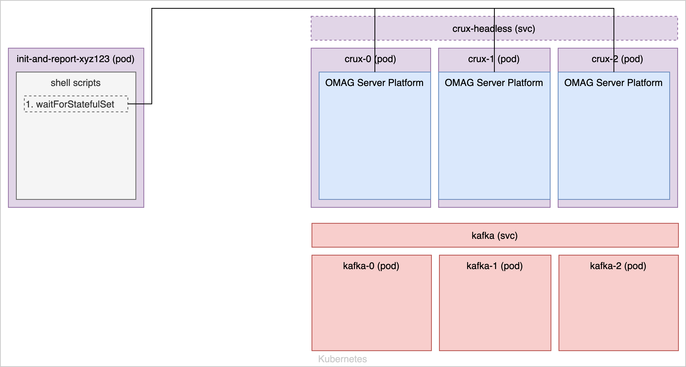
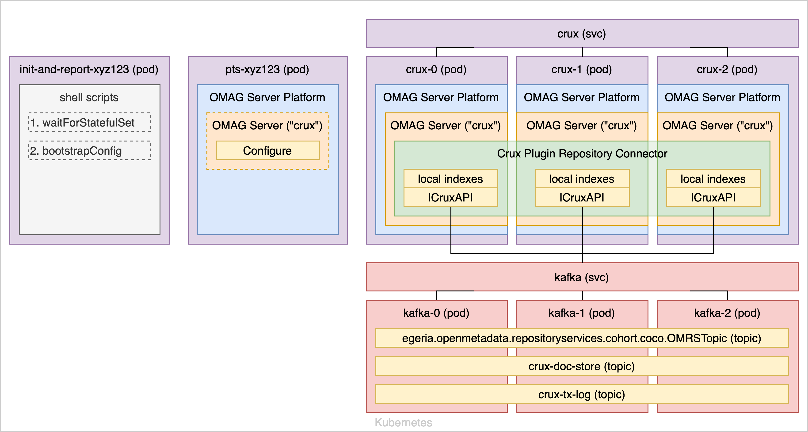
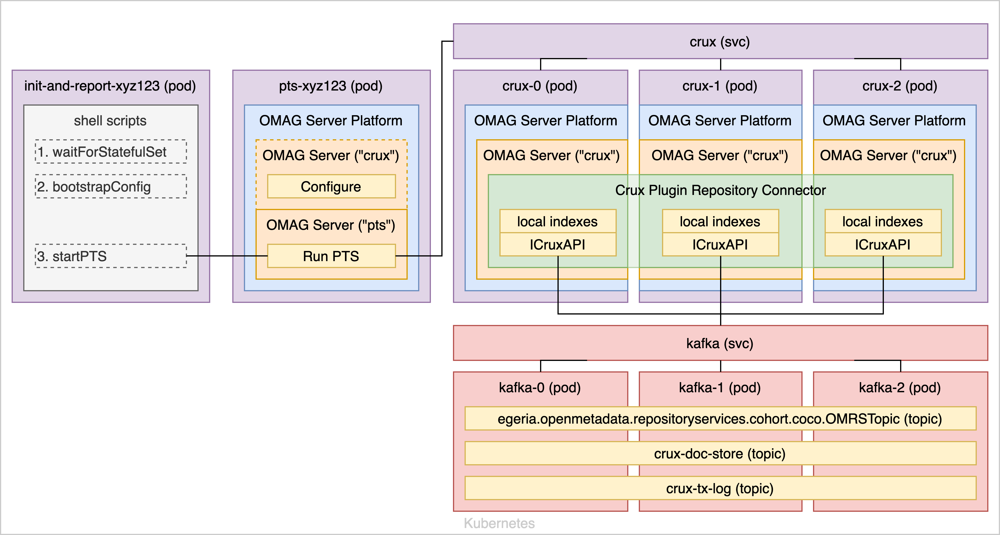
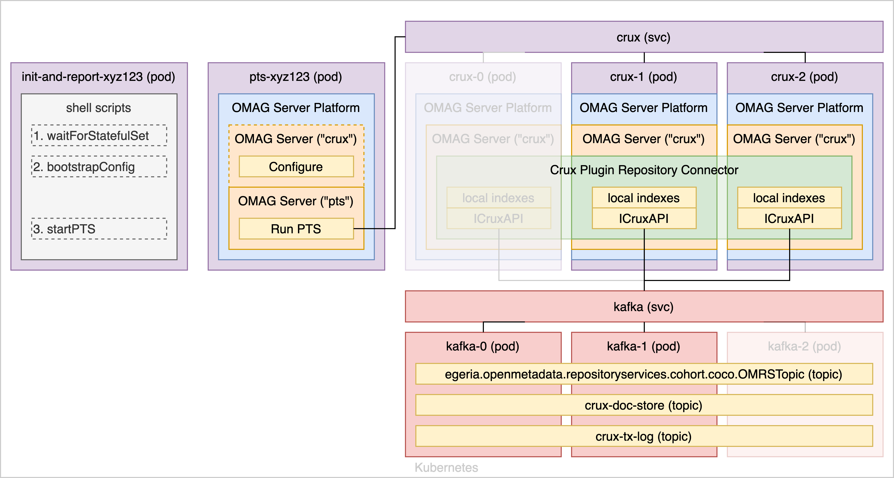

<!-- SPDX-License-Identifier: CC-BY-4.0 -->
<!-- Copyright Contributors to the ODPi Egeria project. -->

# Sample

A sample Helm chart is provided under `cts/charts/ec-ha-crux`. This chart starts up a number of different
elements and configures them in a specific sequence.

## Startup

When it is first deployed, the Helm chart starts a number of pods and services: for Crux, Kafka,
execution of the Performance Test Suite and a pod used for configuration.

Each Crux pod runs its own separate OMAG Server Platform, in its own JVM, and a script in the
`init-and-report` pod will wait until all three pods' OMAG Server Platforms are
running before proceeding to any of the following steps. (The `headless` service
allows each pod to be directly addressed, without load-balancing, to do such a check.)

## Configure

The next script creates a singular configuration document via the `pts` pod, and
deploys this common configuration to each of the pods (again using the `headless`
service to directly address each one individually): each will have a separate `crux`
server configured with the same Crux Plugin Repository Connector (same metadata collection ID).

When the `/instance` is called against each pod to start the connector, each will create a local index
and instance of the `ICruxAPI` interface: all pointing to the same golden stores
(in this example, Kafka) where all persistence for Crux is handled. All servers will refer
to the singular `crux` load-balancing service as their root URL.

## Run

Now when we start the Performance Test Suite, all traffic to the technology under test is
routed via this `crux` load-balancing service: which will round-robin each request
it receives to the underlying pods running the Crux plugin repository connector. Kafka has
a similar service, which handles load-balancing across its own pods for all write operations.

## Outages

Should there be any outage (in the example above, both a Crux pod and a Kafka pod going down)
the Kubernetes services will simply stop routing traffic to those pods and the overall service
will continue uninterrupted.
