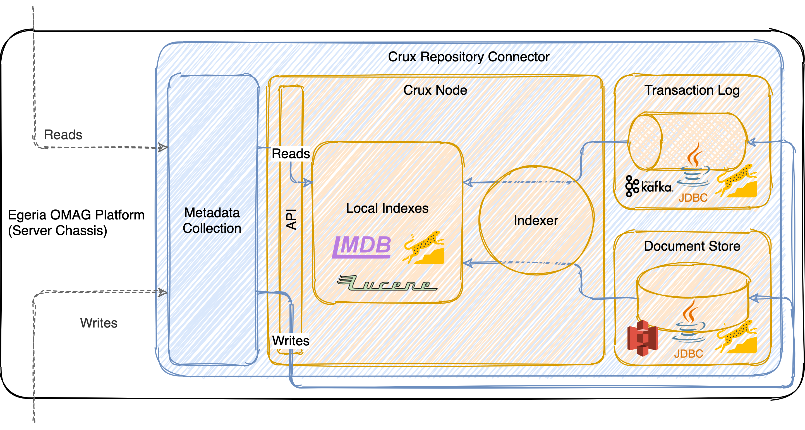

<!-- SPDX-License-Identifier: CC-BY-4.0 -->
<!-- Copyright Contributors to the ODPi Egeria project. -->

# How it works

## Integrating with Egeria

The connector itself is implemented as a plugin repository connector: providing an option for an alternative metadata
repository for Egeria. To do this, the connector integrates into the Open Connector Framework (OCF) and implements the
repository-level methods that adhere to the Metadata Collection interface. These then communicate with
[Crux](https://opencrux.com) via Crux's own API to read and write information to the underlying Crux node.

## Running Crux

Crux itself is started as an embedded process within the connector. It can be configured to use any of the various
pluggable persistence layers supported by Crux itself, and communication between the Java code of the connector and
Crux itself (which is implemented in Clojure) occurs through the Crux Java API (not via REST).

## Interactions between the components

Crux itself handles write transactions and persistence guarantees via its APIs, ensuring that all data is at least
recorded into the transaction log and document store prior to any write method returning.

!!! tip
    By default, the repository connector awaits confirmation that any write has been indexed (and is therefore
    available for read operations) prior to returning. However, it is also possible to configure the connector in an
    "ingest-optimized" mode that allows the indexing to occur asynchronously, and can therefore improve the speed of
    write operations significantly (potentially useful for bulk ingest). This mode can be enabled by setting the
    `syncIndex` configuration option to `false` as part of the connector's configuration.
