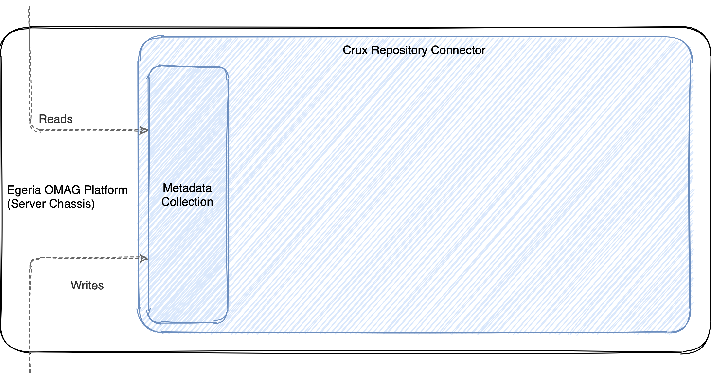
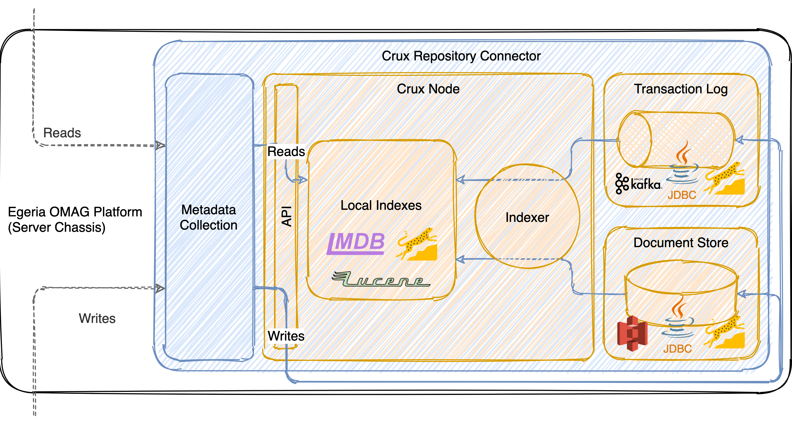

<!-- SPDX-License-Identifier: CC-BY-4.0 -->
<!-- Copyright Contributors to the ODPi Egeria project. -->

# How it works

## Integrating with Egeria

The connector itself is implemented as a plugin repository connector that runs through the
Egeria OMAG Platform (server chassis). It does so by being implemented as an Open Metadata
Repository Connector and implementing the repository-level methods defined by the Metadata
Collection interface.

## Running [Crux](https://opencrux.com)

Crux itself is started as an embedded process within the connector. It can be configured to use any of the various
pluggable persistence layers supported by Crux itself, and communication between the Java code of the connector and
Crux itself (which is implemented in Clojure) occurs directly via the Crux Java API (not via REST).

The Metadata Collection methods simply communicate with Crux via Crux's Java API to read and
write information to the underlying Crux node.

## Interactions between the components

Crux itself handles write transactions and persistence guarantees via its APIs, ensuring that all data is at least
recorded into the transaction log and document store prior to any write method returning.

!!! tip "Synchronous by default, but configurable for asynchronous operation"
    By default, the repository connector further awaits confirmation that any write has been indexed (and is therefore
    available for read operations) prior to returning. However, it is also possible to [configure the connector in an
    "ingest-optimized" mode](../getting-started/setup/#connector-options) that allows the indexing to occur asynchronously,
    and can therefore improve the speed of write operations significantly.
